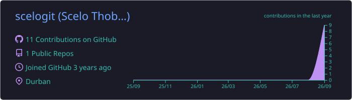
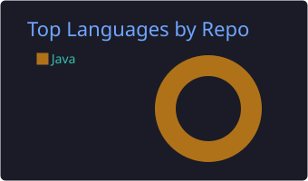
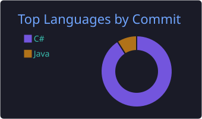
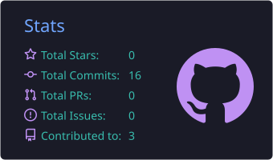
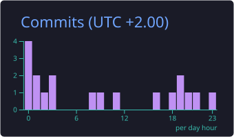

<!-- ─────────────── BANNER ─────────────── -->
<p align="center">
  
</p>

<p align="center">
  <a href="https://git.io/typing-svg">
    
  </a>
</p>

---

<!-- ─────────────── HERO ─────────────── -->
<table align="center" width="100%">
  <tr>
    <td width="60%" valign="middle">
      <h1>Hey ! I'm Scelo </h1>
      <p>
        An <b>IT Diploma student</b> who loves turning ideas into real-world apps —
        from mobile and web to Windows desktop software.
      </p>
      <p>
        🚀 Currently building <b>Kampus</b>, a university-focused social &amp; information platform.
      </p>
    </td>
    <td width="40%" align="center" valign="middle">
      
    </td>
  </tr>
</table>

---

## 🎯 About Me

<table width="100%">
  <tr>
    <td width="60%" valign="top">

```js
const scelo = {
  role: "Diploma in IT Student",
  focus: "Software Development",
  founder: "Kampus",

  building: [
    "Kampus (React Native)",
    "Windows apps with C#",
    "Java desktop apps"
  ],

  learning: [
    "React Native",
    "JavaScript",
    "SQL & Databases",
    "UI/UX Design"
  ],

  tech: {
    mobile:   ["React Native"],
    frontend: ["HTML", "CSS", "JavaScript", "React"],
    backend:  ["Java", "C#", "Python"],
    database: ["MySQL", "SQL"]
  },

  goal: "Build useful products from my own ideas"
};
```

   </td>
   <td width="40%" valign="middle" align="center">
      <blockquote>
        <i>“Learning by building,<br/>improving by creating.”</i>
      </blockquote>
   </td>
  </tr>
</table>

---

## 📬 Connect With Me

<p align="center">
  <a href="https://www.linkedin.com/in/scelo-thobani-devs"></a>
  <a href="https://www.instagram.com/ilo.zuluguy___x2?utm_source=qr"></a>
  <a href="https://www.facebook.com/share/19JE7KugMR/?mibextid=wwXIfr"></a>
  <a href="https://www.tiktok.com/@yilo.zulugut___nje?_r1&_t=ZS-99tr0yd0jjB"></a>
  <a href="mailto:scelothobani26@gmail.com"></a>
</p>

---

## 🛠️ Tech Stack

<table align="center" width="100%">
  <tr>
    <td width="50%" valign="top">
      <h4>Languages</h4>
      
    </td>
    <td width="50%" valign="top">
      <h4>Frontend</h4>
      
    </td>
  </tr>
  <tr>
    <td valign="top">
      <h4>Mobile</h4>
      
      <br/><sub><b>React Native</b></sub>
    </td>
    <td valign="top">
      <h4>Databases</h4>
      
      <br/><sub><b>MySQL · SQL</b></sub>
    </td>
  </tr>
  <tr>
    <td valign="top">
      <h4>Tools &amp; IDEs</h4>
      
    </td>
    <td valign="top">
      <h4>Design</h4>
      
      <br/><sub><b>UI / UX</b></sub>
    </td>
  </tr>
</table>

<p align="center">
  
  
  
  
</p>

---

## 🚀 Featured Project

<table width="100%">
  <tr>
    <td>
      <h3>📱 Kampus</h3>
      <p>
        A <b>university-focused social and information platform</b> designed to bring students together in one place.
      </p>
      <table>
        <tr>
          <td>📰 Campus posts</td>
          <td>📸 Stories</td>
          <td>📅 Events</td>
        </tr>
        <tr>
          <td>💬 Student chats</td>
          <td>🏫 Campus communities</td>
          <td>📢 SRC &amp; student-life updates</td>
        </tr>
      </table>
      <p>
        <b>Tech direction:</b>
        
        
        
        
      </p>
    </td>
  </tr>
</table>

---

## 📚 Currently Learning

```text
React Native       ███████░░░  70%
JavaScript         ███████░░░  70%
HTML / CSS         ████████░░  80%
Java               ███████░░░  70%
C# / WinForms      ██████░░░░  60%
SQL / Databases    ██████░░░░  60%
UI/UX Design       ██████░░░░  60%
```

**My roadmap:**  `Mobile Development` → `Web Development` → `Databases` → `UI/UX` → `Software Engineering`

---

## 📊 GitHub Analytics

<p align="center">
  
</p>

<p align="center">
  
  
</p>

<p align="center">
  
  
</p>

<p align="center">
  
</p>

---

## ✍️ Random Dev Quote

<p align="center">
  
</p>

---

## 🤝 Let's Connect

I'm always open to collaborating on projects, learning from other developers, and building things that matter.

- 💼 **LinkedIn:** [linkedin.com/in/scelo-thobani-devs](https://www.linkedin.com/in/scelo-thobani-devs)
- 📧 **Email:** scelothobani26@gmail.com
- 🌐 **Portfolio:** [Coming Soon]

<br/>

<p align="center">
  <i>💡 "Learning by building, improving by creating."</i><br/>
  ⭐ Feel free to explore my repositories and follow my development journey!
</p>

<p align="center">
  
</p>
